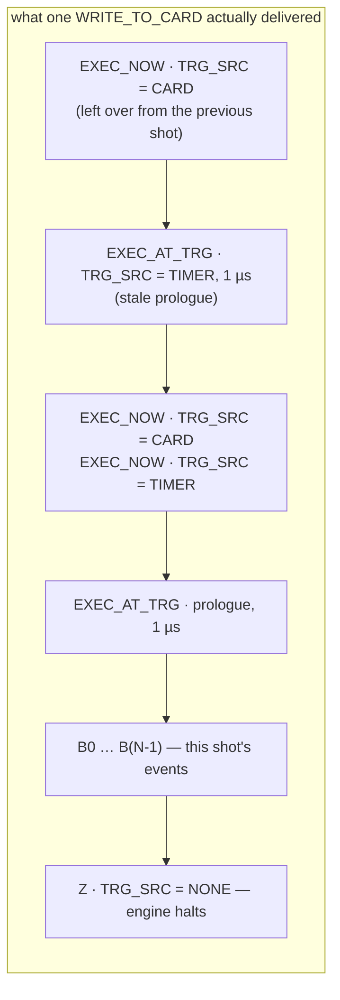

# Why the old DDS driver dropped patterns

A post-mortem on `NeanderthalDDSController`, the driver the `SpectrumDDS` project
replaced. Written after the fact, from the source and from what the new driver's
bench work measured on the card.

Two symptoms were reported over the life of that driver:

- patterns would often be **dropped** — the shot fired but the DDS did not play;
- **almost always the very first pattern of a scan would not fire**.

Both come from one root cause, with several aggravating factors. This document
records it so the same shape of bug is recognisable if it ever comes back.

The old source is not in the working tree. To read it:

```bash
git show 9ede46b5^:NeanderthalDDSController/Controller.cs
```

Line numbers below refer to that blob.

---

## 1. Root cause: the re-arm command never reached the card in time

Chapter 17 of the manual, Table 176, is explicit:

> `SPCM_DDS_CMD_WRITE_TO_CARD` — The driver accumulates all DDS internal settings.
> This command transfers them to the card.

Nothing written reaches the card until a `WRITE_TO_CARD`. **That includes
`EXEC_NOW`.** It is a queued command like any other, not an immediate register
poke — which is why every working example in the manual, and every use in the new
driver, pairs it with a flush.

The old `addPatternToBuffer` ends like this (lines 504–508):

```csharp
Drv.spcm_dwSetParam_i32(hDevice, Regs.SPC_DDS_CMD,     Regs.SPCM_DDS_CMD_WRITE_TO_CARD);
Drv.spcm_dwSetParam_i32(hDevice, Regs.SPC_DDS_TRG_SRC, Regs.SPCM_DDS_TRG_SRC_CARD);
Drv.spcm_dwSetParam_i32(hDevice, Regs.SPC_DDS_CMD,     Regs.SPCM_DDS_CMD_EXEC_NOW);   // never flushed
```

The one command that hands the trigger source back to the external input is issued
**after** the flush. It stays in the library's software FIFO until the *next*
`WRITE_TO_CARD` — one whole shot later.

The same is true of the two `EXEC_NOW`s in the `startRepetitivePattern` loop
(lines 140–145) and the prologue at the tail of `startSinglePattern`
(lines 253–256). All software-side only.

So the command stream that actually arrived at each transfer was the *previous*
iteration's leftovers, followed by this shot's pattern:



The pattern only ever played because the leftover `EXEC_NOW{TRG_SRC = CARD}`
happened to land at the head of the *next* transfer and re-armed the card by
accident.

---

## 2. Why the first pattern of a scan was almost always lost

`PrepareForNewPattern()` (line 408) calls `initializeCard()`, which issues
`M2CMD_CARD_RESET` (line 297) followed by `SPCM_DDS_CMD_RESET` (line 300). That
clears both FIFOs and returns the DDS registers — including `SPC_DDS_TRG_SRC` — to
their defaults.

It therefore **destroys the leftover `EXEC_NOW{TRG_SRC = CARD}`** that had been
re-arming every other shot by accident.

The first transfer of a run is then `[prologue(TIMER, 1 µs), B0…B(N-1), Z(NONE)]`,
with nothing ever having put the live trigger source on the external input. Shot 1
cannot start from the pulse on `DDS_Analog_Trg`. From shot 2 onwards the leftovers
are back at the head of each transfer and the run mostly works again.

That is exactly the reported behaviour: the first shot systematically gone, the
rest mostly fine.

The old code names the symptom without finding the cause. On `waitUntilArmed`
(lines 598–603):

> This fixes the "first trigger is always missing" symptom.

It could not. `waitUntilArmed` polls `SPCM_DDS_STAT_WAITING_FOR_TRG`, which goes
true whenever **any** `EXEC_AT_TRG` block has halted the shadow register —
including the stale prologue. It cannot distinguish "armed on the card trigger for
this pattern" from "armed on a 1 µs timer with last shot's leftovers at the head".

The same failure was reproduced independently from Python while building the new
driver: `run_pattern.py` used to stall on shot 1 with "card never armed"

---

## 3. Why patterns dropped at random mid-scan

Four independent mechanisms, each sufficient on its own.

### 3.1 An unguarded deaf window between every shot

The last block of every shot is `Z{TRG_SRC = NONE}` (lines 500–501). The engine
halts and ignores `DDS_Analog_Trg` completely until the next transfer delivers the
re-arm. That window spans the busy-wait exit plus roughly 18×N register writes.
Any trigger arriving inside it is lost silently.

MOTMaster's `waitUntilArmed(1.0)` was meant to bridge this and could not, for the
reason in §2.

### 3.2 The end-of-shot test fired one block early

```csharp
while (checkCommandNum(hDevice) != 0 && !breakFlag) { }     // line 241
```

`SPC_DDS_QUEUE_CMD_COUNT` **excludes the block held in the shadow registers** —
measured on the card, erratum 7. It reaches zero one event before the pattern
ends. So re-arming began while the shot's last block was still pending, and
`patternsFired++` (line 137) counted shots that had not finished.

### 3.3 `TRG_SRC = TIMER; EXEC_NOW` at the top of every loop iteration

Lines 144–145. Once that leftover lands on the card, the live trigger source is the
timer at whatever `TRG_TIMER` is live — usually the prologue's 1 µs. Blocks
arriving behind it are consumed on a microsecond timer instead of waiting for the
digital pulse: the whole shot burns through in the time it takes to write it.

This is the "queue drains as fast as it is filled" failure.
 Whether it bit on any given shot depended on the order
the leftovers happened to land in — hence the intermittency.

### 3.4 No serialisation, and the shot thread was never joined

`startRepetitivePattern` (line 113) spawns a `Task.Run` that nobody ever waits for.
`stopPattern()` only sets a flag. `PrepareForNewPattern` then resets the card while
that Task may still be inside `addPatternToBuffer` writing registers.

Two threads interleaving writes into one shadow register produce command blocks
that are a mix of two shots. Between scan points this was the normal situation.

The same class of fault was caught in the new driver during remoting testing —
`WaitForShot` ignoring stop requests meant a stop-then-start could leave two shot
threads arming one card — and fixed with an abort callback and a real join.

### 3.5 Two aggravating factors

- The busy-wait at line 241 is a tight `while` with no sleep, hammering the driver
  lock at 100% of a core during precisely the window where arming needs to happen,
  on the same PC that is building NI patterns.
- **Not one return code is checked.** Every call is `code = Drv.spcm_dwSetParam...`
  with `code` discarded. Out-of-range writes are rejected, not clamped
  (erratum 1), so a bad `TRG_TIMER` — duplicate event times giving a gap of zero,
  or a gap outside 83.2 ns … 27.49 s — silently left the previous interval in
  place.

---

## 4. Other latent faults in the same file

Not causes of the dropped patterns, but worth recording:

| Line | Fault |
|---|---|
| 330 | `SPC_DDS_CORES_ON_CH0 = SPCM_DDS_CORE0` is silently snapped to cores 0–46 (erratum 3), and cores 1–46 were never zeroed — so anything left in them leaked into Ch0. |
| 330–333 | Routing written **after** `M2CMD_CARD_START` (line 326), and never read back. |
| 304–311 | Output stages enabled at 1000 mV on every `Go`, with no amplitude clamp of any kind between a script and the AOMs. |
| 582–591 | `getCardTriggerCount()` reads `SPC_TRIGGERCOUNTER` (200905), which this card does not support — it returned −1 for the whole life of the driver. |
| 558 | `SPC_DDS_TRG_COUNT` hard-coded as 608013 "so the code builds even if these symbols are not in Regs". That register number happens to be right, but the manual's neighbouring DDS XIO numbers are mangled (erratum 2) — taking register numbers from the PDF is how that goes wrong. |

---

## 5. What the new driver does differently

| | Neanderthal | SpectrumDDS |
|---|---|---|
| Re-arm to external trigger | separate `EXEC_NOW` **after** `WRITE_TO_CARD` → arrives a shot late | the pattern's **last block carries `TRG_SRC = CARD`** — re-arming is part of the shot |
| Prologue | queued, never consumed | flushed and `FORCETRIGGER`d in `Prime()`, leaving the shadow registers empty |
| End of shot | `QUEUE_CMD_COUNT == 0`, one block early | `TRG_COUNT` advancing by the event count, from a baseline taken at arm time |
| Between shots | engine halted on `TRG_SRC = NONE` | armed continuously; `ShotPending` stops a second copy being queued |
| Stale queue | accumulates in the software FIFO | `PrepareForNewPattern` → `SilenceNow` → `DiscardQueuedShots` |
| Threading | `Task` never joined, no lock | `CardLock`, join with timeout, abort callback |
| Return codes | ignored | `SpcmCard` throws on any non-zero |
| Pattern checking | none | `Validate` against `SPC_DDS_AVAIL_*` and the clamps before anything is queued |
| Routing | written after start, never verified | legal mask, read back and compared; all 50 cores silenced |

**The structural difference that matters: the new driver never issues a command
that has to arrive later.** Everything the card needs in order to run shot *n+1*
is inside shot *n*'s transfer.

---

## 6. Confidence, and how to nail it down

The reasoning in §1 rests on `EXEC_NOW` requiring a `WRITE_TO_CARD` to reach the
card. That is the manual's own wording for `WRITE_TO_CARD`, and it is how every
worked example in chapter 17 and every use in the new driver is written — but the
old code was never put on the card to watch it happen.

If it is ever worth confirming: read `SPC_DDS_NUM_QUEUED_CMD_IN_SW` (608011)
immediately after that `EXEC_NOW`. A non-zero count is the command still sitting
in the library queue. `dds_python/spectrum_dds.py` can do this in a couple of
lines.

Everything else here is either plain in the source or already measured and
recorded as an erratum in and
`.claude/skills/spectrum-dds/`.
