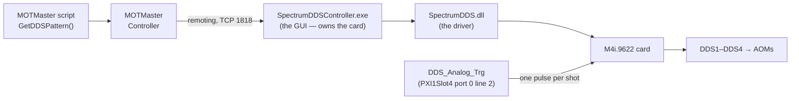
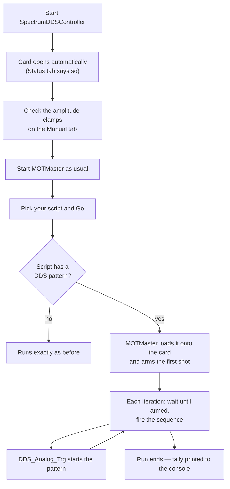
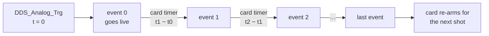

# The Spectrum DDS — user guide

The Spectrum M4i.9622 card gives the MoleculeMOT four independent RF outputs
(DDS1–DDS4) that drive the AOMs. A MOTMaster script says what frequency and
amplitude each output should have at each moment of the sequence; the card does the
rest.

This is the new driver, written from scratch. **Nothing in your scripts has to
change**: `GetDDSPattern()` still returns the same dictionary it always did.

---

## The parts



**SpectrumDDSController** is a separate program from MOTMaster, on purpose: it owns
the card, and manual tone control works with MOTMaster closed. MOTMaster just talks
to it. If the controller is not running, MOTMaster still starts normally — it only
complains when you run a script that has a DDS pattern.

---

## Everyday use: running an experiment



Opening the card **emits no RF**: every core is left silenced, so the output stages
come up carrying nothing.

At the end of a run the four channels **hold the last event's frequency and
amplitude** until the next pattern is loaded. That is deliberate — it is what the
experiment wants between runs.

The console line at the end of a run is worth reading:

```
DDS triggers -- sent: 200, fired: 200, missed: 0, card count: 1399
```

`sent` is triggers MOTMaster fired, `fired` is patterns the card ran to completion.
Anything other than `missed: 0` means shots went out while the card was still
re-arming. `card count` is the card's own counter and only means anything as a
difference between reads.

---

## Writing a DDS pattern in a script

Override `GetDDSPattern()` and use `DDSPatternBuilder`. Times are in **pattern
ticks** (10 µs), exactly like the digital pattern, and `t = 0` is the pulse on
`DDS_Analog_Trg` — the Q-switch instant.

```csharp
public override Dictionary<string, List<List<double>>> GetDDSPattern()
{
    DDSPatternBuilder p = new DDSPatternBuilder();

    // name, time in ticks, frequencies (MHz x4), amplitudes (0-1 x4)
    p.AddEvent("MOT", 0, motFrequencies, motAmplitudes);

    // ... and with ramps: frequency slopes (MHz/tick), amplitude slopes (per tick)
    p.AddEvent("RampStart", rampStart, motFrequencies, motAmplitudes,
               null, rampAmplitudeSlopes);

    p.AddEvent("RampEnd", rampEnd, motFrequencies, rampEndAmplitudes);

    return p.Pattern;
}
```

Every array is four long, in channel order:

| Script channel | Output | Drives |
|---|---|---|
| `DDS1` | Ch0 | |
| `DDS2` | Ch1 | |
| `DDS3` | Ch2 | |
| `DDS4` | Ch3 | |

| What | Units |
|---|---|
| time | pattern ticks (10 µs) |
| frequency | MHz, 0 to 625 |
| amplitude | fraction of the channel output level, 0 to 1 |
| frequency slope | MHz per tick |
| amplitude slope | amplitude per tick |

Pass `null` for a slope array when nothing is ramping. Event names must be unique —
you get a clear exception if they are not.

### How a pattern actually runs

One external trigger starts the shot; the card's own timer steps through the rest of
the events. You do not need a trigger per event.



A ramp started at one event runs until the next event overwrites it, so give a ramp
an end event with the value you want to land on.

---

## The controller window

### Status tab

Card identity and limits, plus a live readout: DDS status, queued commands, trigger
count, patterns fired, which pattern is loaded, output states, output level and the
amplitude clamps. **Open card / Close card** is here.

When MOTMaster pushes a pattern over, the Pattern tab picks it up within a quarter
of a second and the label under the grid says *loaded by MOTMaster*.

### Pattern tab

A grid of events (time, and f / amp / df / da for each of DDS1–DDS4) with frequency
and amplitude plotted against time underneath. You can add and remove events, edit
cells, and **Load / Save** patterns as JSON.

- **Apply to card** — hand this pattern to the driver, as MOTMaster would.
- **Run / Stop** — start or stop the loop that re-arms a shot per trigger.
- **Test trigger** — fire one trigger in software. This reaches the DDS card and
  nothing else: no NI board, no sequence. Use it for scope checks with the
  experiment idle.

The **XIO** column is edited and saved with the pattern, but **it drives nothing on
this card** — the hardware will not route the per-event markers to a pin. The Status
tab says so explicitly.

### Manual tab

One row per channel: frequency, amplitude, clamp, **Apply now**, and an output
enable tick. Plus a card-wide output level in mV and a **Silence all** button.

Applying a manual tone throws away any armed pattern — the two cannot coexist. So
set your tones for alignment work, then load the pattern again before running.

Frequencies, amplitudes, clamps and the output level are remembered across restarts
(`%APPDATA%\SpectrumDDSController\settings.json`). Restoring them only fills the
spinners — **no RF goes out until you press Apply now**.

---

## Amplitude clamps

Each channel has its own safety clamp, defaulting to 1.0 (max. A pattern or manual
tone asking for more is **rejected**, with a message naming the channel and the
value.

---

## Debug logging

The Status tab has a **Debug log level / path** row. This is the same setting
the vendor's separate "Spectrum Control Center" tool edits — Control Center is
no longer needed for it.

Two things worth knowing before you touch it:

- **Apply does not take effect on the connection already running.** It writes
  the setting, but the driver only picks it up the next time the card is
  opened — close and reopen the card (or restart the program) for a level
  change to actually change what gets logged.
- **Level 3 ("log all") is expensive during a real run**, not just noisy. The
  per-shot arming wait polls the card in a tight loop, and at level 3 every
  one of those polls is a log write — a real, demonstrated candidate for
  missed shots and hangs on a long run, not a theoretical one. Run at a low
  level for normal operation and only raise it while you are actively
  chasing something.

The log file itself (`spcmdrv_debug.txt`, in whatever directory the path box
names) rotates on its own once a day — the previous day is archived as
`spcmdrv_log_{date}_level{n}.txt`, date first so alphabetical order in a file
browser is also date order. Old rotated files are not deleted automatically;
clean them up by hand as before.

That is the *driver's* log, and it is enormous. There is a much smaller one,
`Logs\controller_events_{date}.log` at the root of the EDMSuite folder, holding
just this program's own errors and the end-of-run tallies — start there, and
only open the driver log if the answer is not in it. See
[LOGGING.md](../LOGGING.md).

## What gets saved

Every saved run's zip contains `*_ddsPattern.json` beside the digital and analog
patterns, written in the same units the script used (ms, MHz, per-ms), next to the
copy of the `.cs` file. Scripts with no DDS pattern write no file.

---

## When something goes wrong

| What you see | What it usually is |
|---|---|
| *"Could not connect to ... 1818"* when you Go | SpectrumDDSController is not running. MOTMaster offers to start it. |
| *"the Spectrum DDS card is not open"* | Open it on the Status tab, or say yes to MOTMaster's prompt. |
| *"amplitude ... exceeds its ... safety clamp"* | Raise that channel's clamp on the Manual tab. |
| *"the gap from A to B is ... below the card's timer minimum"* | Two events closer than 83 ns. Space them out. |
| *"share the time ... so their order is ambiguous"* | Two events at the same tick. |
| No RF from an AOM | Output stage unticked on the Manual tab, or amplitude at zero. |
| RF is there but the frequencies never change | The script has no DDS pattern, or the run stopped and the channels are holding the last event. |
| Card status stuck at *idle* while the experiment runs | No trigger reaching the card — check `DDS_Analog_Trg`. |
| `QUEUE UNDERRUN` / `QUEUE OVERRUN` on the Status tab | Something is wrong with the trigger setup; close and reopen the card. |
| Output runs a whole shot behind the sequence | Stale shots queued from a previous run. Loading a new pattern clears them; **Silence all** does too. |
| Every script fails to compile | The `AdditionalMOTMasterAssemblies` path list in the file system class points at something that is not there. |

Two counters on the Status tab do **not** mean what they look like, so don't draw
conclusions from them: *queued commands* reaches zero one event before a pattern
ends, and *card trigger count* reads one low after a reset and never catches up.

If it already went wrong and you are piecing it together after the fact, the
errors and run tallies are on disk in `Logs\controller_events_{date}.log` at the
root of the EDMSuite folder — see [LOGGING.md](../LOGGING.md).

---

## Things worth knowing about the card

- **DDS is the only mode it has** — there is no AWG to fall back on, and no firmware
  to switch.
- Cores 1–46 are summed onto Ch0 along with DDS1, so the driver silences all 50
  cores whenever it silences anything.
- The card rejects out-of-range values rather than clamping them, and the driver
  checks every return code — so a bad number gives you an error, never a silent
  wrong setting.
- Nine places where the card contradicts its own manual are documented in
  `.claude/skills/spectrum-dds/`.
- Why the old NeanderthalDDS driver dropped patterns, and lost the first shot of
  every scan, is written up in [OLD_DRIVER_POSTMORTEM.md](OLD_DRIVER_POSTMORTEM.md).
